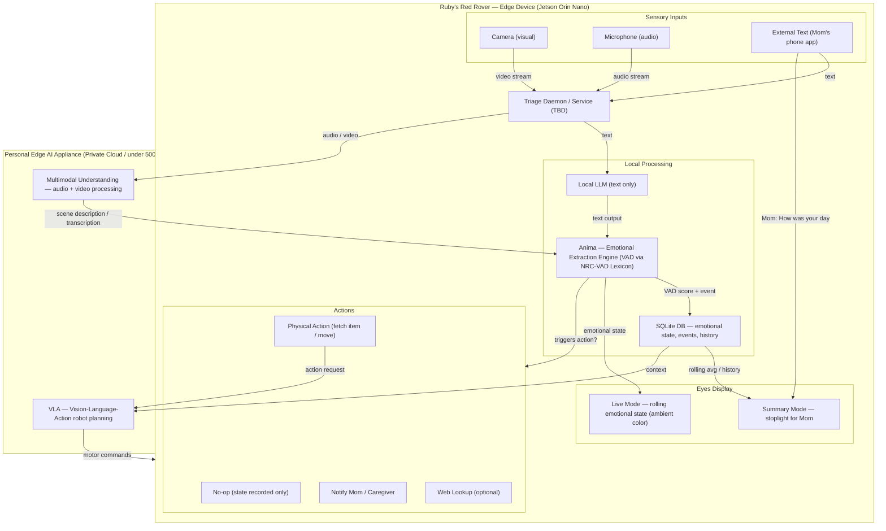

# Ruby's Red Rover 🤖

A sense-and-regulate companion robot designed to detect emotional states and respond with appropriate regulatory actions — think service dog for emotional regulation.

## Overview

Ruby is built around a continuous loop: **sense → understand → score → act**. Sensory inputs (visual, audio, text) are triaged, processed for emotional content using VAD (Valence-Arousal-Dominance) scoring, recorded, and responded to with calibrated actions. Ruby's eyes display the current emotional state in real time, and can switch into a summary mode to give Mom a quick "how was the day" stoplight readout.

**Ruby's rover continuously builds a spatial understanding of its environment and uses it to ground decisions in real-world context.**

## Architecture

## Key Components

### On-Device (Jetson Orin Nano)
- **Triage Daemon** — receives all sensory input and routes it for processing.
- **Local LLM** — lightweight text-only model for on-device inference
- **Anima** — emotional extraction engine, scores text using the NRC-VAD Lexicon for Valence, Arousal, and Dominance
- **SQLite** — local store for events, states, history, spatial memory
- **Eyes** — RGB display reflecting live emotional state; switches to stoplight summary mode on demand

### Personal Edge AI Appliance (Private Cloud / <500W)

- **Multimodal Understanding** — handles audio and video processing beyond on-device capability; produces text descriptions fed back into Anima and VLA Planner
- **Spatial Memory (SAM)** — continuously builds a map of objects and their locations in the environment. Using Meta's SAM, the robot identifies and tracks objects as it moves through space, storing this in a local, queryable spatial memory. This allows the robot to know “what is where” instantly, instead of re-reasoning over raw perception.
- **VLA (Vision-Language-Action) Planning** — evaluates whether anything should happen at all. When an event is detected, VLA decides: no-op, act, or escalate. Ruby's rover doesn’t just react to emotion, it understands context, decides what matters, and acts (or chooses not to). Actions are triggered by voice (“Ruby it’s time for your medicine”), schedule (2pm medication), or direct input (“I have a headache”). Given current context, including emotional state, history, and spatial memory, VLA determines the appropriate response. Responses range from simple actions (fetching an item) to escalation (notifying Mom when something seems wrong). In many cases, the correct action is no action. These behaviors aren’t hardcoded. Ruby learns them from Mom or a caregiver: actions are demonstrated once, then trained into ACT (Action Chunking with Transformers) policies for repeatable execution. Simulation data could help, but learning happens locally.

The system operates in two modes: real-time during the day, learning at night. Training runs overnight on the edge appliance while the companion sleeps, using otherwise idle compute. 

#### Option 1: The Home Base

You can reset a password. You can’t reset a child’s face.
That data never leaves the home.

The edge appliance handles everything the Jetson can't: multimodal understanding of audio and video, VLA planning for physical responses. Not to a server, not to an API, not to anyone. All inference runs locally, on private hardware that blends into a home. 

**The engineering insight:** Real-time action requires throughput, not maximal precision—so we optimize for bandwidth, not bits. Every token requires pulling model weights from memory, more compute doesn’t help, but bandwidth does. The RTX 5090 at 1,792 GB/s delivers 200 tokens/sec sustained on Gemma 4 26B A4B (Q4_K_M), **matching Google's own hosted Gemini 2.5 Flash throughput**, private under 500W. For power-constrained deployments, the RTX PRO 4500 Blackwell delivers ~143 tok/sec at 190W; 75% of the throughput at 60% of the power draw, same model, same quality. At the far end, Jetson-class systems (e.g., Jetson Thor) enable silent, embedded deployments that disappear into the home, trading peak throughput for form factor. Portability is also possible on modern laptops, albetit with a lower tps.

Q4_K_M isn't a compromise. This is a VLA system generating action commands rather than essays. It’s the right balance of quality, bandwidth, and power for this use case.

| Metric | Value |
|--------|-------|
| Model | Gemma 4 26B A4B (Q4_K_M) |
| Sustained generation | ~200 tokens/sec |
| Prompt processing | ~3,800 tokens/sec |
| VRAM | 19,214MB / 32,607MB |
| Power (under load) | 319W |
| Multimodal | ✅ Vision encoder |
| Network required | ❌ None |

**What doesn't work**
Higher precision (Q6/Q8) reduced throughput without improving action quality, so we dropped it. Human-speed interaction needs defines the required system performance. 

#### Option 2: Away From Home

When the home base isn’t available, to school, travel, grandma’s house, the same model runs on a laptop. Same privacy guarantee. Just slower. Works for astronauts and rovers wandering around Mars too.

**The architectural inversion:** Apple Silicon's unified memory removes the constraint that forces quantization on discrete GPUs. 64GB of unified memory means Gemma 4 26B fits at Q8, essentially lossless with 37GB to spare. With this laptop we can actually run *higher fidelity weights* than the home base GPU, at lower power, with the same privacy guarantee. It's slower (~25 tok/sec vs 200), but for non-time-critical VLA decisions that's well above the threshold for useful action planning. When bandwidth is constrained, we optimize for throughput (Q4). We don’t optimize for precision or speed, we optimize for the constraint of the environment.

One `pip install mlx-lm` away. No CUDA. No drivers. No rack.

| Metric | Value |
|--------|-------|
| Model | Gemma 4 26B A4B (Q8) |
| Sustained generation | ~25 tok/sec (est.) |
| VRAM | ~27GB / 64GB unified |
| Power (under load) | ~30-40W (est.) |
| Multimodal | ✅ Vision encoder |
| Network required | ❌ None |
| Quality vs Option 1 | ✅ Higher (Q8 vs Q4_K_M) |

The throughput drops. The quality goes up. The power drops by 8x. 

## Sense & Regulate Loop

1. Sensory input arrives (camera, mic, or external text input from Mom's app)
2. Daemon triages and routes to local LLM (text) or Edge Appliance (audio/video); the environment is grounded into spatial memory
3. All paths produce text, which is scored by Anima for VAD
4. Event + state recorded to SQLite
5. Eyes updated with recent emotional color
6. VLA evaluates: no-op, physical response, caregiver notification, or web lookup. Physical responses are planned by VLA and executed via learned ACT motion primitives on-device
7. Other modes such as asking "How was your day?" activates eyes display stoplight which summarises day's history

## Status

> 🚧 Early development hackathon baseline, functional reference. 

## Submission 

[RoboHacks on HackIterate.com](https://hackiterate.com/robohacks?tab=submissions&submission=a340d5b2-9fc9-481c-a666-1d24ae5e94a9)

## Repositories 
[innate-os](https://github.com/rubysredrover/innate-os) - primary: on-robot system for performing activities 
[mom_app](https://github.com/rubysredrover/mom_app) - front end app for caregiver
[reachy-eyes](https://github.com/rubysredrover/reachy-eyes) - LED eyes controler, HAL, and demos
[anima-engine](https://github.com/rubysredrover/anima-engine) - emotion extraction engine

Other references:
[rubysredrover](https://github.com/rubysredrover/rubysredrover) - early impl, superseded by robot 
[r3](https://github.com/rubysredrover/r3) - emotional engine impl, superseded by robot
[robohacks-utils](https://github.com/rubysredrover/robohacks-utils) - Innate refs

# Team (Alphabetical) 
[Aashish Kumar](https://www.linkedin.com/in/aashish-kumar-703915174/)
[Alison Cossette](https://www.linkedin.com/in/alisoncossette/)
[Daniel Ritchie](http://linkedin.com/in/danielritchie123)
[Gautam Nain](https://www.linkedin.com/in/gautamnain/)
[Risi Jaiswal](https://www.linkedin.com/in/risi-jaiswal-08b4215b/)
[Venkat Ram](https://www.linkedin.com/in/venkatrama/)

